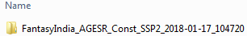
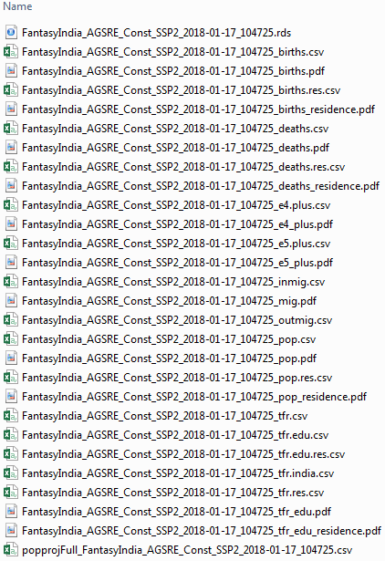

```{r setup, include = FALSE}
library(MSDem)
knitr::opts_chunk$set(echo = TRUE)
options(scipen = 10)
```

# Introduction

This vignette is about running a multistate population projection using the `msproj()`-function and reading the input data files required to do so using function `fread.msproj()`. Details about the creation of state spaces can be found in the _"Creating and filling the state space"_ vignette.

# Reading the data

We assume that a state space has already been created and the corresponding .csv-Files have been filled. Function `msproj()` that runs the simulations requires that the data are passed as a list, with each list element corresponding to one of the .csv's that have been saved when creating the state space using the `state.space()` function. Users of the package may read all the required components (`state.space`, `variable.definitions` and possibly `migration`) separately and create the required list manually, but `MSDem` also provides a convenience function called `fread.msproj()` that automates this process (based on the `fread()` function that comes with the `data.table`-package, hence its name). As already mentioned in the _"Creating and filling the state space"_ vignette, this only works as expected if the user does not change names and structure of the files that have been created using the `state.space()` function.  

`fread.msproj()` has two arguments:

```{r}
args(fread.msproj)
```

* `data.dir` the path to the directory that contains the data sets. Defaults to the subdirectory "input_data/" of the current working directory. If users want to use a different directory, they have to specify the whole path instead.
* `model.patt` the name of the scenario as contained in the names of all relevant data sets. This pattern is automatically generated when setting up the state space, made up of the `country` and/or `scen` arguments of the `state.space()`-function.  

Consider that we created a state space for India using the following code:

```{r}
reg <- c("IN.AN", "IN.AP", "IN.AR", "IN.AS", "IN.BR", "IN.CH", "IN.CT", "IN.DD", "IN.DL", 
         "IN.DN", "IN.GA", "IN.GJ", "IN.HP", "IN.HR", "IN.JH", "IN.JK", "IN.KA", "IN.KL", 
         "IN.LD", "IN.MH", "IN.ML", "IN.MN", "IN.MP", "IN.MZ", "IN.NL", "IN.OR", "IN.PB", 
         "IN.PY", "IN.RJ", "IN.SK", "IN.TN", "IN.TR", "IN.UP", "IN.UT", "IN.WB")
st.sp3 <- state.space(region = reg, edu = 6, country = "India", scen = "AGESR_Const", migration = "bilateral")
```

This is similar to the second state space created in the _"Creating and filling the state space"_ vignette, apart from the migration that now is bilateral, which means that the exact origins and destinations of the migrants are known. We would read the (filled) data files as follows (assuming that the data is saved in the default directory as given above):

```{r, eval = FALSE}
datasets = fread.msproj(model.patt = "India_AGESR_Const")
```

`datasets` then is a list having three components:

```{r, echo = FALSE}
datasets <- st.sp3[1:3]
names(datasets) <- c("India_AGESR_Const_mig", "India_AGESR_Const_state_space", "India_AGESR_Const_var_def")
```

```{r}
names(datasets)
```

The list elements have been named after the csv's that were read.   

Subsequently, a dataset for a fantasy India consisting of just two states will be used to demonstrate how the data looks like and how a projection is run. The dataset comes with the package and can be loaded using `data(fantasy_india)`. For further information, see the help file (`?fantasy_india`). The dataset has the following 3 components:

```{r}
data(fantasy_india)
names(fantasy_india)
```

Let's have a look at the two components that contain the data in turn.

## The migration component

The first few lines of the filled migration file look like the following (note that only the first 8 of the 76 columns are presented):

```{r}
head(fantasy_india$India_AGESR_Const_mig)
```

The first thing we notice is that there is an `origin` column, but no `destination` column. The reason for this was already explained _"Creating and filling the state space"_ vignette: Choosing the wide format saves rows, which helps us to avoid problems if users want to use Microsoft Excel to fill the file. Thus, each region/residence combination (`IN.AN_urban` etc.) can be viewed as a separate `destination` column.  

## The state space component

Also for this component we want to have a look at the first 6 lines and the first 8 columns:

```{r}
head(fantasy_india$India_AGESR_Const_state_space)
```

There are `r fantasy_india$India_AGESR_Const_state_space$IN.AN_urban[1]` males aged zero and belonging to the lowest educational group in the rural parts of the Andaman and Nicobar Islands region, `r fantasy_india$India_AGESR_Const_state_space$IN.AP_urban[1]` show the same pattern in Andhra Pradesh etc. Since there are no persons with an educational level above `e1` in this age group, all the other entries are zeroes.

The last 6 lines give us the following information:

```{r}
tail(fantasy_india$India_AGESR_Const_state_space)
```

Here we see the educational attainment progression ratios for females in 2105, with zeroes for those transitions that are not possible.

# Running a projection

## Simulation parameters

Once the data have been read correctly, `msproj()` is used to run the population projection. This function has the following arguments (as you will note, some of them are marked as "not used at the moment", i.e., it is planned to include them in future versions of the package):

```{r}
args(msproj)
```

- `data` a list containing the data needed to run the simulation. It has to include sublists containing the state space, the variable definitions, and (optionally) the flows of migration as defined by the `state.space` function. Defaults to NULL.
- `patt` the pattern of the model to be run. Used to create meaningful file names (especially when detailed output is generated). Defaults to NULL.
- `country` the name of the country (or more general, the highest level in the hierarchy of geographic units) the projections are done for. Used to annotate plots and tables that are created automatically when argument `detail.out` is set to `TRUE`. Defaults to NULL. If no country is specified, the variable definition file is checked for an entry. If no country is given there, too, the generic name `country` will be used.
- `SSP` the Shared Socioeconomic Pathway that forms the basis for the simulation assumptions concerning fertility, mortality, internal migration, reclassification, and education. Defaults to SSP2 (middle of the road scenario). Not used at the moment.
- `fert` an optional vector specifying changes in the fertility assumptions for the whole simulation horizon. Should be `NULL` (the default) if the middle of the road fertility assumptions of SSP2 are used, a vector of length `iPr`, i.e., corresponding to the number of simulation periods (e.g., years or 5-year-periods) or a single number that is than replicated `iPr` times. The values of these vectors represent the relative changes in comparison to the SSP2 assumptions (see examples). Not used at the moment.
- `mort` an optional vector specifying absolute changes in comparison to the base mortality assumptions. In contrast to `fert`, the vector values specify absolute changes in comparison to SSP2 for the life expectancy at age 0. Not used at the moment.
- `int.mig` an optional vector specifying relative changes in comparison to the base internal migration assumptions, comparable to `fert`. Not used at the moment.
- `recl` an optional vector specifying relative changes in comparison to the base reclassification assumptions, comparable to `fert`. Not used at the moment.
- `edu` an optional vector specifying relative changes in comparison to the base educational transition assumptions, comparable to `fert`. Not used at the moment.
- `detail.out` logical. Should detailed output be written to the "output_data" directory, which includes frequency tables and pdf's? Defaults to `FALSE`.
- `nSx` the information used to compute the nSx's. Defaults to `"axmx"`, i.e., the nSx's are computed using ax and mx. Alternatively, the computation can be based on `"le0"`.
- `iPr` the number of simulation periods. Must be smaller or equal to the number of periods in the simulation horizon. Defaults to 18 in compliance with the default simulation horizon (90 years = 18 five-year periods).
- `reclass.model` an R object of class "glm" containing the reclassification model. Needed to estimate the proportion of the rural population that is reclassified depending on the current population distribution between urban and rural areas. Defaults to NULL.
- `reclass.period` an integer number specifying the space of time for the reclassification data, i.e., the number of years it takes to observe the specified proportion of reclassification. Defaults to 5.
- `mig.adj` logical. Should the internal migration rates be adjusted to account for the changing proportions of rural and urban population that occur when the simulation is run? Defaults to `FALSE`.
- `maxeapr5` a vector specifying the upper limits for the education transition rate to post-secondary attainment among upper-secondary attained. The total value is used if there is no differentiation between urban and rural areas in the model. In contrast, if residence is considered, separate values may be used for rural and urban areas. The possible values are bounded between 0 and 1.

## A projection for India

With the `fantasy_india`-dataset loaded above, we now run a simulation. We only specify three of the function's arguments: `data` is straightforward, `reclass.period` is set to 10 years because that is the number of years it takes to observe the levels of reclassification given in the input data, and `patt` is used to create meaningful path and file names:

```{r}
res <- msproj(data = fantasy_india, reclass.period = 10, patt = "FantasyIndia_AGESR_Const")

```

While the projection is running, the user gets constantly informed about the current projection period.

## Results

Results are available in R and in the form of tables tables and graphs saved to the output_data folder.

### Results in R

Let's have a look at the components of the R object `res`:

```{r}
names(res)
```

We get a list containing the following 11 components:

- `pop` A contingency table in array representation of S3 class `c("xtabs", "table")` containing the total population numbers. The dimensions are period, sex and (if included in the model) region and/or residence.
- `births` A contingency table in array representation of S3 class `c("xtabs", "table")` containing the number of births. The dimensions are period, sex and (if included in the model) region and/or residence.
- `deaths` A contingency table in array representation of S3 class `c("xtabs", "table")` containing the number of deaths. The dimensions are period, sex and (if included in the model) region and/or residence.
- `net.mig` A contingency table in array representation of S3 class `c("xtabs", "table")` containing the net migration numbers, i.e., the difference between in-migration and out-migration. Thus, the numbers are negative if the out-migration is higher. The dimensions are period, sex and (if included in the model) region and/or residence.
- `prop.pop` A table containing the proportion of urban population for each year of the simulation period and (if included in the model) subdivided by region.
- `prop.reclass` A table containing the proportion of reclassified population (rural to urban) for each year of the simulation period and (if included in the model) subdivided by region.
- `fert` Relative changes of fertility in comparison to the SSP2 assumptions throughout the simulation horizon (see above for details).
- `mort` Absolute changes of mortality in comparison to the SSP2 assumptions (see above) throughout the simulation horizon (see above for details).
- `int.mig` Relative changes of internal migration in comparison to the SSP2 assumptions throughout the simulation horizon (see above for details).
- `recl` Relative changes of reclassification in comparison to the SSP2 assumptions throughout the simulation horizon (see above for details).
- `edu` Relative changes of educational transition in comparison to the SSP2 assumptions throughout the simulation horizon (see above for details).

We now have a look on some of the results in turn (Note: Since the projection starts in 2010, the results for Andhra Pradesh do not take the effects of the Andhra Pradesh Reorganisation Act from 2014 into account). As outlined above, the total population numbers are saved in the `pop` component, subdivided according to the dimensions included in the model. Function `dimnames()` can be utilized to find out about the dimensions:

```{r}
dimnames(res$pop)
```

Thus, `period` is dimension no. 1, `sex` dimension no. 2 etc. If we are interested in the original table entries, we use the following code:

```{r}
res$pop["2055", "male", "IN.AN", "rural"]
```

We specified the year we are interested in, the sex, the region, and the residence, and got the corresponding number: In 2055, the projected number of males living in the rural areas of the Andaman and Nicobar Islands region is `r res$pop["2055", "male", "IN.AN", "rural"]`.  

If we are not only interested in these projected population numbers for region `IN.AN`, but all the Indian regions, we just do not provide a value for the corresponding dimension:

```{r}
res$pop["2055", "male", , "rural"]
```

We can aggregate the data using the `margin.table()`-function to calculate the numbers we are interested in. E.g., if we wanted to know the total population by period, not taking into account sex, region, and residence, we would use the following code:

```{r}
margin.table(res$pop, margin = 1)
```

The `margin` argument specifies the dimension we are interested in (`1` stands for the first dimension, which is `period`, as described above). If we wanted to know the population for each period, but separately for each region, we would just specify the vector of the dimensions of interest:

```{r}
margin.table(res$pop, margin = c(1, 3))
```

Births, deaths, and net migration can be analyzed the same way (see component description of the output above).

When looking at the `prop.pop` component, we observe a steadily increasing urban population in both states, with Andhra Pradesh getting ahead of the Andaman and Nicobar Islands region in the 2030s:

```{r}
res$prop.pop
```

Since we didn't specify a reclassification model, the observed proportion of population reclassified from rural to urban areas stays the same for the whole projection period (the small differences for `IN.AN` result from rounding).

```{r}
res$prop.reclass
```

### Results saved in the "output data" folder

Apart from the R object that contains the results, the "output_data" folder in the working directory now contains a new subfolder:



Since we didn't set `detail.out = TRUE`, only two files are included in this folder:


The file with the ".rds" extension contains the list of results as specified above. R's `readRDS()` function can be used to restore the original R object. The second file is a .csv that holds the simulation results, too, but much more detailed. For every possible population pattern, all the relevant numbers are given for the whole simulation horizon:


Not all the columns can be presented in this screenshot, but the following list provides a short description of them:

- `pattern` A character string summarizing some information about the subgroup of the population in the corresponding line. Used internally, can be ignored by the users.
- `sex` Sex of the subgroup.
- `age` Age of the subgroup.
- `edu` Level of education of the subgroup.
- `period` Beginning year of the period.
- `region` Region of the subgroup.
- `residence` Residence of the subgroup.
- `pop` Total population at the beginning of the period: How many people belong to the subgroup?
- `nSx` Survival ratio.
- `pop1` Total population after applying the mortality component = Number of people surviving (`pop1 = pop * nSx`).
- `deaths` Number of deaths in the total population (`deaths = pop - pop1`).
- `areasex` Used internally, can be ignored by the users.
- `pop2` Total population after applying the education component = People are redistributed among the education categories.
- `outmig` Internal out-migration: Number of people migrating to other regions and/or residences within the country.
- `inmig` Internal in-migration: Number of people migrating from other regions and/or residences within the country.
- `pop3` Total population after applying the migration component (`pop3 = pop2 - outmig + inmig`).
- `asfr` Age-specific fertility rate of the subgroup (number of births per 1000 women in one year).
- `pop3.shift` Total population aged by the length of one simulation period (e.g., for five-yearly simulation steps, peopled age 20 become 25, people aged 25 become 30 etc.).
- `births` Number of children born for a certain group of women in the childbearing years. Applied to the populations before and after aging and then halved, i.e., averaged (`births = asfr * (pop3 + pop3.shift) / 2`) 
- `area` Used internally, can be ignored by the users.
- `deaths.nb` Number of deaths among the newborns.
- `pop3.shift.total` Sum of rural and urban population for the current pattern (i.e., `pop3` is aggregated for patterns that only differ in their residence values).
- `perural` Percentage of rural **or** urban population, relating to the value of residence in the corresponding line.
- `reclasstr` Percentage of population reclassified.
- `pop4` Total population after applying the reclassification component.  
for rural areas: `pop4 = (pop3.shift.total * perural) - (pop3.shift.total * perural * reclasstr)`  
for urban areas: `pop4 = (pop3.shift.total * perural) + (pop3.shift.total * (1 - perural) * reclasstr)`

For instance, in line no. 3, we see that there are 2061096 females aged 0-4 that have no education and live in the rural areas of Andhra Pradesh at the beginning of the 2010-2014 period. The nSx-value is about 0.984, thus 32905 of them die and 2028191 survive etc.

Let's now run the simulation again, but this time we set `detail.out = TRUE`:

```{r}
res <- msproj(data = fantasy_india, reclass.period = 10, patt = "FantasyIndia_AGESR_Const", detail.out = TRUE)
```

This doesn't change the results given in R, but additional files are saved into the subfolder containing the results:



&nbsp;

These additional files hold aggregated information about births, deaths etc. and some projection statistics in tabular and graphical form (saved as .csv's and pdf's, respectively). For example, the .csv-file having "e4plus" in its name contains the proportion of people having completed educational level 4 or above, separately for each period, region, and sex:


&nbsp;

Two figures (one for each region) are auomatically produced using this information, the one for Andhra Pradesh is presented here:

{ height=70% width=70% }

&nbsp;

The upward trend for both sexes can be seen, with the females surpassing the males in the 2040s. 