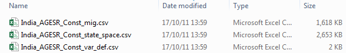
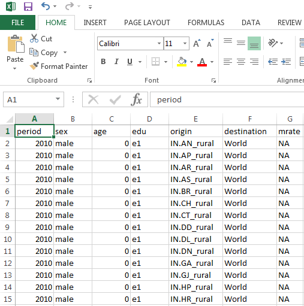

```{r setup, include = FALSE}
library(MSDem)
knitr::opts_chunk$set(echo = TRUE)
options(scipen = 10, width = 80)
```

# Introduction

Doing a population projection using the `MSDem`-package involves four consecutive steps:

1. Defining the state space
2. Filling the empty state space files
3. Reading the state space files
4. Setting the simulation parameters and running the projection

This vignette concentrates on the first two of these steps, the other two are explained in the _"Running a population projection"_ vignette. We show how a state space is created using the `state.space()`-function, which leads to the generation of empty .csv's in a standardized form. These files then have to be filled by the users and are the input needed to run the population projection (using function `msproj()`) subsequently.

Besides explaining the arguments of the `state.space()`-function, two state spaces are created to exemplify the output that is created. In addition, details about filling empty state spaces are given. We assume that readers of this vignette are familiar with some of the R data types, namely vectors, matrices, data frames, and lists.

# Creating the state space - a simple example

Bringing the `MSDEM`-package into being, we quickly realized that when following the 'easy-to-use' paradigm, we have to sacrifice some flexibility. In particular, this concerns the structure of the data sets that are passed to `msproj()`, the function that is used to run the population projection. To bring the data into a standardized form, `state.space()` has to be utilized. That function has a number of arguments that can be used to change the default settings. Depending on the choices made by the user, running `state.space()` results in the generation of two or three .csv-files that are saved in a specific input data folder (see below):

1. The state space file itself
2. A helper file containing the variable definitions
3. A file containing the migration information. This file is only created if migration is possible, which means that some spatial information (region and/or residence) must be available.

Let's have a look at the list of function arguments first:

```{r}
args(state.space)
```

In the following, each of these arguments is described briefly:

* `period` a sequence used to define the time horizon (i.e., start year and end year) and the time increment for the simulation. By default, simulations start in 2010 and end in 2100 with 5-year steps. Note that using other time steps (e.g., single-year transitions) is not possible at the moment.
* `region` an optional vector of region names that has to be entered by the users if they want to do a sub-national projection (region here stands for any administrative level below the national one, this could be regions, states, districts, municipalities etc.). Should be `NULL` (if no regions are used) or a character vector.
* `residence` an optional vector with the two values `urban` and `rural` used to specify the distinction between urban and rural areas in the model. Should be `NULL` or the default character vector.
* `sex` a vector containing the two values `male` and `female`. The usage of `sex` is mandatory in any of the models, and thus, it is part of every state space. It is only possible to change the labels (e.g., to `m` and `f`).
* `age` a vector containing three values: Minimum age, maximum age, and the width of each age category. It defaults to a minimum age of 0 years, a maximum age of 100 years, and five-year age groups. Internally, the value 1 is automatically added to the sequence in keeping with the structure of standard life tables. Just like `sex`, it is mandatory to use this variable. Note: Conditioned by the 5-year steps (see above), five-year age groups must be used at the moment.
* `edu` an optional vector specifying the number of educational levels to be used in the simulation. Should be `NULL` (the default) if education is not used in the simulation or a single number.
* `migration` the type of internal migration used in the model. Should be either `biregional` (the default) or `bilateral`. Biregional means that for a given geographical unit, it is not of interest where the migrants come from or where they go to, i.e., there is only one outgoing (to the rest of the country) and one incoming stream (from the rest of the country). When using bilateral migration, the exact origins and destinations of the flows are specified. Migration only makes sense if either `region` or `residence` or both are used in the model. If this is not the case, no file containing the migration information will be produced (see above). Note: International migration is currently not included in the model.
* `mig.var` the type of migration data used in the state space. Should be either `mrate` if migration rates are to be used or `mabs` in the case of absolute migration numbers. Note: At the moment, the model doesn't provide the functionality to work with absolute numbers.
* `country` the name of the country the simulation is ran for. This information is used in the output generation of the model (e.g., to annotate plots and tables) and to create file names. If no value is provided by the user, the default (`World`) is used.
* `scen` the name of the scenario that is ran. Just like `country`, this information is used to create meaningful file names.
* `data.dir` the name of the directory the files are written to. By default, a subfolder called "input_data" is created automatically within the current working directory, and the files are then saved into this folder. If users want to use another directory, they have to specify the whole path instead.

Let's first create the files for the most basic model that can be run, only taking mandatory variables `age` and `sex` into account. Hence, we get a state space without any educational and geographical information (i.e., neither region nor residence is considered). The only argument we have to change is `residence`. We save the function output in an object called `st.sp` and then have a look at its structure:

```{r}
st.sp <- state.space(residence = NULL)
str(st.sp)
```

We see that `st.sp` is a list having three elements: The first two correspond to the two .csv's that are later saved into the data folder (we will inspect these below), the third one provides information about the possible education transitions (not saved into the data folder). We will now have a look at each of the three elements in turn.

## The state space component

Printing the first few lines of the state space component gives us the following:

```{r}
head(st.sp$state.space)
```

We observe a data frame with five columns: `period`, `sex`, `age`, `var`, and `value`. As it is the case for `sex` and `age`, `period` also is mandatory for every model. Every line of the state space represents a certain group/subpopulation, defined by a combination of these three obligatory variables. Column `var` specifies the pieces of information that have to be provided by the users. Everything on the right-hand side of this column (here: only column `value`) has to be filled by them. Looking at the first six entries of `var`, we see that all have the same entry called `pop`. `pop` is short for "total population" and means that the user has to enter the total population numbers for each of the subpopulations into column `value`. At the moment, nothing is filled in, the NA's stand for missing values (see section "Filling the state space files" below).   

Let's check how many different `var` entries exist for the given state space:

```{r}
table(st.sp$state.space$var)
```

We got

* `pop` total population
* `le0` life expectancy at birth
* `mx` death rate in the cohort between ages x and x + n
* `ax` average number of person-years lived in the interval by those dying in the interval
* `asfr` age-specific fertility rate (ASFR)
* `sexr` sex ratio at birth (female by male)
* `reclasstr` proportion of population reclassified from rural to urban
* `gap` difference between a region's reclassification rate and the average rate (i.e., the country rate)
* `perural` percentage of the population living in rural areas
* `eapr` educational attainment progression ratio

Note that for each of those variables, values only have to be provided if it is meaningful for a certain subpopulation. For example, the total population numbers have to be filled in for every possible age-sex combination, but only for the base year. There are 21 age groups and 2 sexes, thus 42 combinations. In contrast to that, the ASFR has to be provided for every year of the simulation horizon, but only for the meaningful combinations of age and sex (i.e., women aged 15-49), and thus, other subpopulations are not included in the state space in combination with the ASFR. This results in 126 possible combinations (7 age groups of women times 18 periods). Another example can be seen if we have a look at the last few lines of the data frame:

```{r}
tail(st.sp$state.space)
```

In line no. `r nrow(st.sp$state.space)`, the sex ratio of the newborns has to be provided. `sexr` is a variable independent of any age-sex-period combinations (hence, the NA's for these variables), and thus, only one value is needed.

Since no reclassification is happening and no education is considered in the current model, no values have to be filled in for `reclasstr`, `gap`, `perural`, and `eapr`.

## The variable definition component

List element two looks like the following:

```{r}
st.sp$variable.definitions
```

As said above, it is there to inform users about certain settings of the current model. We see that

* "World" is used as country name, i.e., the default value wasn't changed by the user
* The simulation horizon is 2010-2100 (since the values do not stand for single years, but for five-yearly periods, i.e., "2095" in fact means "beginning of 2095 until end of 2099")
* males and females are considered
* ages from 0 to 100 are considered in five-year steps (except the first group, which is subdivided into 0--1 and 1--5)
* migration is not considered (it cannot be since there are no regions or places of residence)

## The educational transition component

The third list element, called `edu.trans`, can be used to get information about the education transitions that are possible in the model:

```{r}
st.sp$edu.trans
```

Per default, education is not considered in the multistate model, and so the transition matrix does not exist here. Note: At the moment, the user can only specify the number of education levels, but not the possible transitions (i.e., from which level to which level can one go?) themselves. This will be changed in a later version of the package.

# A more complex state space

We now assume that we want to run a simulation for India that includes all the possible dimensions: Age, Sex, Education, Region, and Residence. Since there are no default regions, we would have to create a vector of the Indian regions first:

```{r}
reg <- c("IN.AN", "IN.AP", "IN.AR", "IN.AS", "IN.BR", "IN.CH", "IN.CT", "IN.DD", "IN.DL", 
         "IN.DN", "IN.GA", "IN.GJ", "IN.HP", "IN.HR", "IN.JH", "IN.JK", "IN.KA", "IN.KL", 
         "IN.LD", "IN.MH", "IN.ML", "IN.MN", "IN.MP", "IN.MZ", "IN.NL", "IN.OR", "IN.PB", 
         "IN.PY", "IN.RJ", "IN.SK", "IN.TN", "IN.TR", "IN.UP", "IN.UT", "IN.WB")
```

We used the ISO codes since they provide a standardized form that is not prone to misspellings or different spellings (e.g., like "Dehli", "dehli", "NCT of Dehli", "nct of Dehli" etc.) which may cause problems in the simulation. We create the state space with the following line of code:

```{r}
st.sp2 <- state.space(region = reg, edu = 6, country = "India", scen = "AGESR_Const")
```

Apart from the regions, we also specified that we are having six educational levels, that our country is India, and that we want to call our scenario _AGESR\_Const_, which stands for an **A**ge/**G**ender/**E**ducation/**S**tate/**R**esidence scenario under constant assumptions (e.g, no changes in fertility patterns, migration rates etc. for the whole simulation horizon). `st.sp2` has the following structure:

```{r}
str(st.sp2)
```

Besides the already known `state.space`, `variable.definitions` and `edu.trans` components that differ from the first state space created above, `st.sp2` also contains a `migration` component. Again, we want to have a closer look at all of the list components in turn.

## The state space component

As can be seen above, the state space now has a different structure: Variables `period`, `sex`, `age` and `edu` are still there, but instead of one `value` column, there now are 70 columns with region/residence combinations (35 regions times 2 types of residence). The reason to choose this wide format of the table is Microsoft Excel's limitation to approximately 1 million rows it can handle. We suspected that most `MSDem`-users will use Excel to fill in the values, and thus thought it would be a good choice to have a higher number of columns, but save many rows in return.  

For the India example we see that our state space has `r nrow(st.sp2$state.space)` rows times `r ncol(st.sp2$state.space)` columns. If we would have chosen the long format, the number of rows would have been 70 times higher (the region/residence combinations), giving us a value relatively close to the maximum that Excel can handle, namely `r nrow(st.sp2$state.space) * 70`. If there were some additional regions (or educational levels, or age groups etc.), we would have exceeded this limit.  

Using this structure, we can regard each of the region/residence combinations as a separate `value` column: Instead of filling in just one value for each period/sex/age/edu pattern, we have to fill in 70. As an example, we consider the sex ratio of the newborns again. For the first state space, there was just _one_ line that had to be filled with _one_ value. Now, there is still one line

```{r}
st.sp2$state.space[st.sp2$state.space$var == "sexr", 1:10]
```

but we have to provide 70 different sex ratio values (note that we just printed the first 10 columns here).  

The `var` entries of the state space haven't changed, but since region, residence and education are considered now, there are no categories that aren't present in the state space anymore, i.e., users also have to provide values for  `reclasstr`, `gap`, `perural` and `eapr`:

```{r}
table(st.sp2$state.space$var)
```

What is more, the number of rows that have to be filled have changed, too: For example, there are `r table(st.sp2$state.space$var)["le0"]` lines for variable `le0` now, the `r table(st.sp$state.space$var)["le0"]` of the first state space (see above) multiplied by the 6 educational levels. From this it follows that the number of `le0` values that have to be provided is 420 (= 70 * 6) times higher than in the "simple" state space created above.

## The migration component

Like the `state.space` component, the `migration` list element also contains `period`, `sex`, `age`, and `edu` columns to define the population patterns, but there are three additonal columns related to migration:

```{r}
head(st.sp2$mig)
```

* `origin` the geographical unit of origin. This may be the rest of the world/country or a subnational unit, i.e., a region, a place of residence, or a combination of these, depending on the type of migration (bireginal or bilateral, see above) and the consideration of region and/or residence.
* `destination` the geographical unit of destination. The same rules as for `origin` apply.
* `mrate` the migration rate, i.e., the number of people emigrating from or immigrating to a certain geographical unit, given as fraction of the geographical unit's total population.

Since we didn't change the default value of the `migration` argument when creating the state space, the migration is assumed to be biregional. Thus, people can only emigrate to the rest of the world or immigrate from the rest of the world, the exact origins of immigrants and destinations of emigrants are not specified.

## The variable definition component

The variable definition component now also contains information about region, residence, the consideration of reclassification (here: `TRUE`), and possible educational transitions. Furthermore, the type of migration has changed from `no migration` to `biregional`:

```{r}
st.sp2$variable.definitions
```

## The educational transition component

Since education wasn't considered in our first state space above, we merely got `NULL` when calling the corresponding list element. Now, with the consideration of 6 educational levels, we can have a look at the possible transitions between them:

```{r}
st.sp2$edu.trans
```

The rows indicate the "from" (= current), the columns the "to" (= attainable) educational levels. A `0` entry means that a transition is not possible (e.g., directly going from `e1` to `e6`), `1` stands for possible transitions within a five-year period of the simulation. We see, e.g., that

* it is only possible to go up by one or two levels (e.g., from `e1`, people can go to `e2` or `e3`, but not to `e4`, `e5` or `e6` directly)
* it is not possible to go down (e.g., from `e2` to `e1`)

The main diagonal ( `e1` to `e1`, `e2` to `e2`) is not of interest here, since remaining at the same level is not considered as a "transition".

# Filling the state space files

The "empty" files (meaning that they only contain NA's) that have been generated are written into a subfolder of the current working directory using R's `write.table()` function. The files with endings _state\_space.csv_ and _mig.csv_ have to be filled by the user, but not the file having the ending _var\_def.csv_ since it is only there to provide some useful information about the current state space.

For our second state space, the files in the "input_data" subfolder of our working directory are:




We see the naming convention of the files: Country followed by scenario, followed by the information contained in the file, with the parts separated by underscores. This convention is utilized later when we run the simulation. Opening one of the files using a spreadsheet program like Microsoft Excel, we see that the structure of the corresponding list element (see above) was maintained:



It doesn't matter if the files are filled with the required information using R or some spreadsheet program or editor, but it is important that the simulation itself is contingent upon the files **exactly as they have been created by `state.space()`**, i.e., the user should not change anything, not the name of the files, not the structure within the files! Thus, the empty files that were created should be overwritten once the data have been entered.